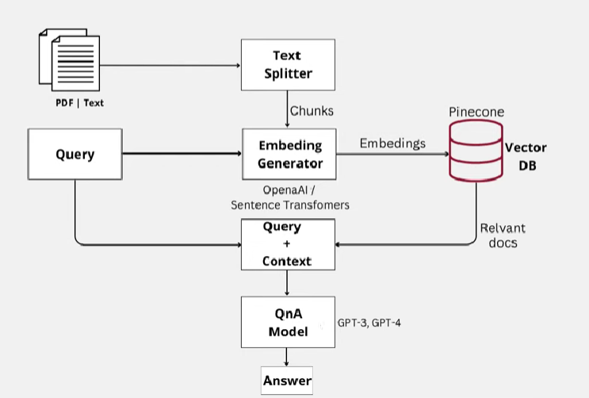
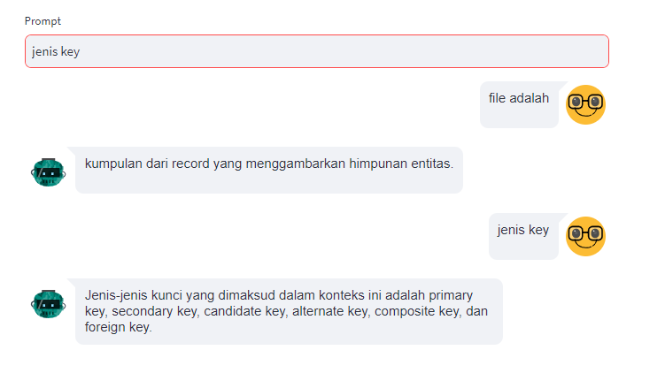

## Multiple PDFs Chatbot using Streamlit, Langchain, Pinecone, and Open AI



### Project Overview
This repository contains a multiple PDFs chatbot built using Streamlit, Python, Langchain, FAISS, and Vertex AI. The chatbot allows users to upload PDF files, specify a service account (JSON), and provide the Google Cloud Platform (GCP) project ID to interact with the chatbot and extract information from the uploaded PDFs.

### Tech Stack
* [**Streamlit**](https://streamlit.io/): A web app framework for Python.
* [**FAISS**](https://faiss.ai/index.html): a library for efficient similarity search and clustering of dense vectors (Local vector store).
* [**Langchain**](https://python.langchain.com/docs/get_started/introduction): A library for natural language processing (NLP).
* [**Vertex AI**](https://cloud.google.com/vertex-ai?hl=en): A managed machine learning (ML) platform on Google Cloud. It is an alternative for OpenAI.


### Features
1. Chat to multiple PDF files.
2. Store the knowledge base (vectorized pdf files) into Pinecone.
3. Create Pinecone index and insert pdf files into a collection via terminal/command (without accessing Pinecone console)
4. Extract information from the uploaded PDFs (pinecone's index) using Langchain by entering the question.
5. Able to memorize the previous question by using `ConversationalRetrievalChain` from Langchain
6. Able to ask and answer in any languages



### Installation
Follow the steps below to set up and run the PDF chatbot:

#### 1. Clone the Repository

```bash
git clone https://github.com/ridwanspace/multiple-pdf-chatbot-pinecone-openai.git
cd multiple-pdf-chatbot-pinecone-openai
```

#### 2. Install Dependencies
```bash
pip install -r requirements.txt
```
#### 3. Create `.env` then fill them with your own credentials
```bash
PINECONE_API_KEY = xxxx
PINECONE_ENV = xxx
PINECONE_INDEX_NAME = xxxx
OPENAI_KEY = xxx
```

#### 4. Put your pdf files into `files` folder

#### 5. Create Pinecone index by running below command
```bash
cd pinecone
python create_index.py
```

#### 6. Create Pinecone index by running below command
```bash
python ingest_docs_to_index.py
```

#### 7. Run the Chatbot
```bash
cd ..
streamlit run app.py
```
Visit the provided URL in your browser to interact with the PDF chatbot.


### Cost
Check this [pricing](https://openai.com/pricing) in Open AI

