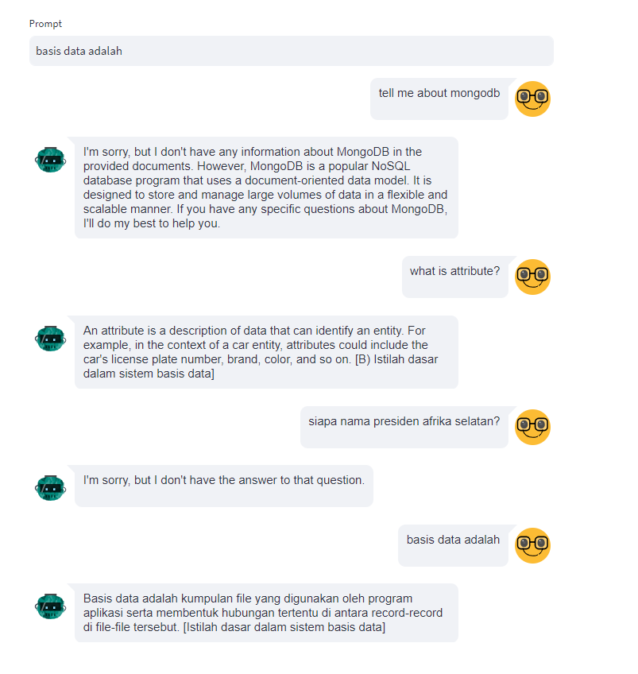

## Multiple PDFs Chatbot using Streamlit, Langchain, Pinecone, and Open AI


### Project Overview
This repository contains a multiple PDFs chatbot built using Streamlit, Python, Langchain, Pinecone, and Open AI. The chatbot allows users to convert PDF files into vector store (Pinecone's index), then we are able to interact with the chatbot and extract information from the uploaded PDFs.

Given a knowledge base whose vectors are stored in a pinecone, the chatbot provides answers to the questions that are most relevant to the context (called as knowledge base == vector store).

### Tech Stack
* [**Streamlit**](https://streamlit.io/): A web app framework for Python.
* [**Pinecone**](https://www.pinecone.io/): an online vector database to store our vectorized pdf files.
* [**Langchain**](https://python.langchain.com/docs/get_started/introduction): A library for natural language processing (NLP).
* [**Open AI**](https://platform.openai.com/docs/overview): A service to call the llm and embedding model for our QA app

### Features
1. Chat to multiple PDF files.
2. Store the knowledge base (vectorized pdf files) into Pinecone.
3. Create Pinecone index and insert pdf files into a collection via terminal/command (without accessing Pinecone console)
4. Extract information from the uploaded PDFs (pinecone's index) using Langchain by entering the question.
5. Able to memorize the previous question by using `ConversationalRetrievalChain` from Langchain
6. Able to ask and answer in any languages
7. Will answer `I don't know` if being asked non-related questions (not exist in vector database)


Screenshot : Related and Non Related questions



### Installation
Follow the steps below to set up and run the PDF chatbot:

#### 1. Clone the Repository

```bash
git clone https://github.com/ridwanspace/multiple-pdf-chatbot-pinecone-openai.git
cd multiple-pdf-chatbot-pinecone-openai
```

#### 2. Install Dependencies
```bash
pip install -r requirements.txt
```
#### 3. Create `.env` then fill them with your own credentials
```bash
PINECONE_API_KEY = xxxx
PINECONE_ENV = xxx
PINECONE_INDEX_NAME = xxxx
OPENAI_KEY = xxx
```

#### 4. Put your pdf files into `files` folder
```
├───files
```

#### 5. Create Pinecone index by running below command
```bash
cd pinecone
python create_index.py
```

#### 6. Create Pinecone index by running below command
```bash
python ingest_docs_to_index.py
```

#### 7. Run the Chatbot
```bash
cd ..
streamlit run app.py
```
Note: Please return to root folder at first before running the app


### Cost
Check this [pricing](https://openai.com/pricing) in Open AI

